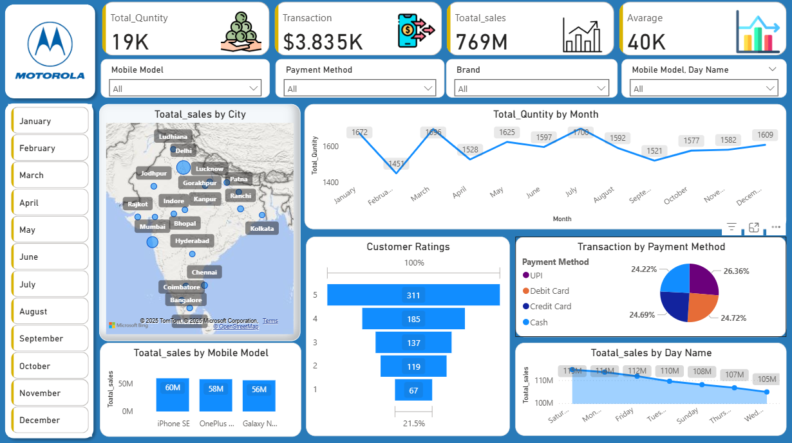

# 📊 Mobile Sales Dashboard | Power BI

<p align="center">


</p>

---

# 📌 Project Overview

The **Mobile Sales Dashboard** is an interactive **Power BI** dashboard developed to analyze mobile sales performance across different brands, models, cities, payment methods, and customer ratings.

The dashboard transforms raw sales data into meaningful business insights using **Power BI, Power Query, DAX, and Data Modeling**, enabling businesses to monitor KPIs, identify sales trends, and make informed decisions.

---

# 🎯 Business Objectives

✅ Analyze overall sales performance

✅ Compare sales across mobile brands

✅ Monitor city-wise sales trends

✅ Evaluate customer ratings

✅ Analyze payment method preferences

✅ Build an interactive business dashboard

---

# 🛠️ Tech Stack

| Tool | Purpose |
|------|---------|
| Power BI | Dashboard Development |
| Power Query | Data Cleaning & Transformation |
| DAX | KPI Measures & Calculations |
| Data Modeling | Relationship Management |
| Excel | Data Source |
| Interactive Visuals | Business Insights |

---

# 📊 Dashboard KPIs

| KPI | Description |
|------|------------|
| 💰 Total Sales | Overall Revenue |
| 📦 Total Quantity Sold | Number of Products Sold |
| 💵 Average Sales | Average Revenue |
| ⭐ Customer Ratings | Satisfaction Analysis |
| 📈 Transactions | Sales Performance |

---

# 📈 Dashboard Features

📱 Brand-wise Sales Analysis

📊 Model-wise Performance

🌍 City-wise Sales Analysis

💳 Payment Method Distribution

⭐ Customer Rating Analysis

📅 Monthly Sales Trend

🎛 Interactive Filters & Slicers

📌 KPI Cards

---

# 💡 Key Insights

✔ Identified top-performing mobile brands based on total sales.

✔ Compared sales performance across multiple cities.

✔ Analyzed customer ratings to understand buying satisfaction.

✔ Evaluated payment methods preferred by customers.

✔ Monitored monthly sales trends to identify seasonal patterns.

✔ Built an interactive dashboard for business decision-making.

---

# 🚀 Business Impact

- Improved sales performance monitoring.
- Simplified business reporting.
- Enabled interactive sales analysis.
- Supported data-driven decision-making.
- Identified customer purchasing trends.

---

# 📷 Dashboard Preview

<p align="center">



</p>

---

# 📂 Repository Structure

```text
📁 PowerBI-Sales-Dashboard
│
├── 📄 README.md
├── 📊 Sales_Dashboard.pbix
├── 📄 Mobile Sales Data.xlsx
│
└── 📁 images
      ├── 📄 README.md
      └── 🖼️ Sales_Dashboard.png
```

---

# ⭐ Skills Demonstrated

- Power BI
- Power Query
- DAX
- Data Cleaning
- Data Transformation
- Data Modeling
- Dashboard Design
- KPI Reporting
- Data Visualization
- Business Intelligence

---

# 📌 Key Learnings

- Built an interactive Power BI dashboard for sales analysis.
- Applied Power Query for data cleaning and transformation.
- Used DAX to create business KPIs and calculations.
- Designed interactive visualizations for business reporting.
- Converted raw sales data into actionable business insights.

---

## 👨‍💻 Author

### **Vinay Siddharudh Thisake**

**Data Analyst | Power BI | SQL | Python | Excel | Salesforce**

📧 Connect with me on **LinkedIn** for collaboration and opportunities.

---

## ⭐ Support

If you found this project helpful, please consider giving it a **⭐ Star** on GitHub!
